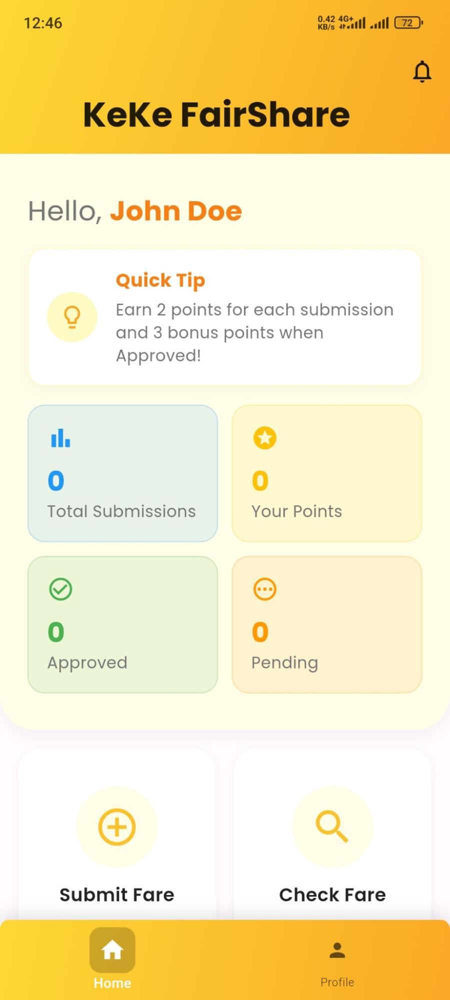
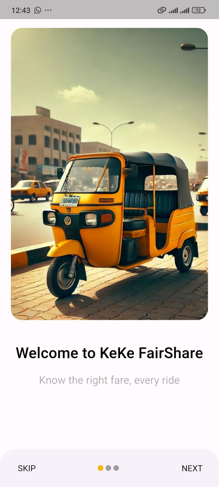
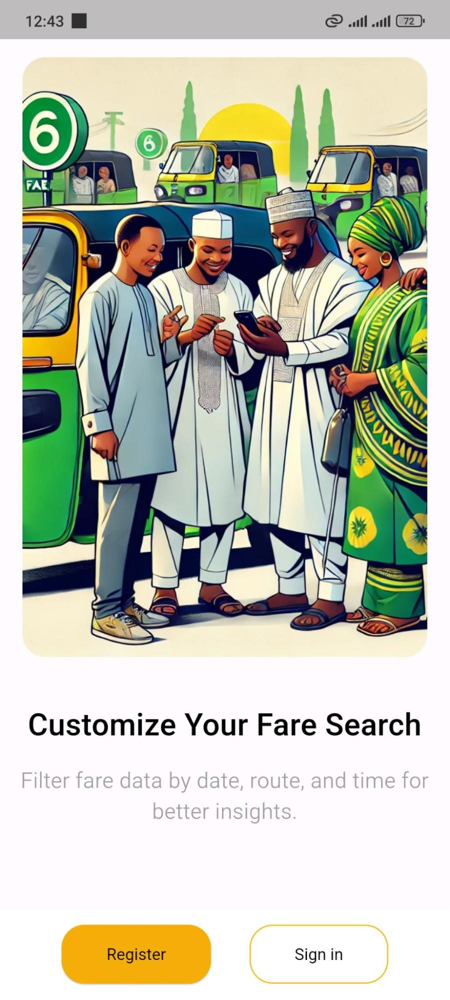
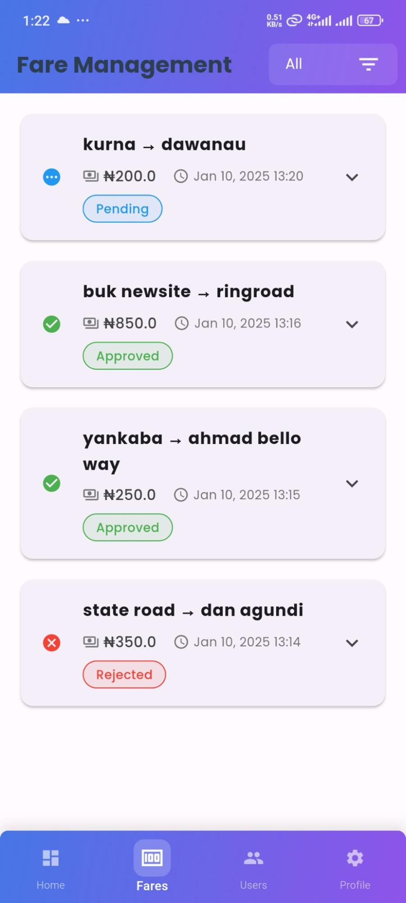
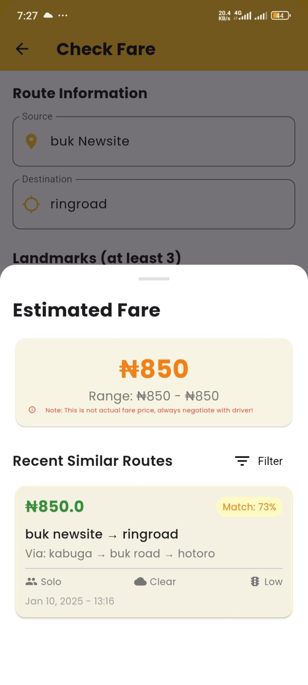
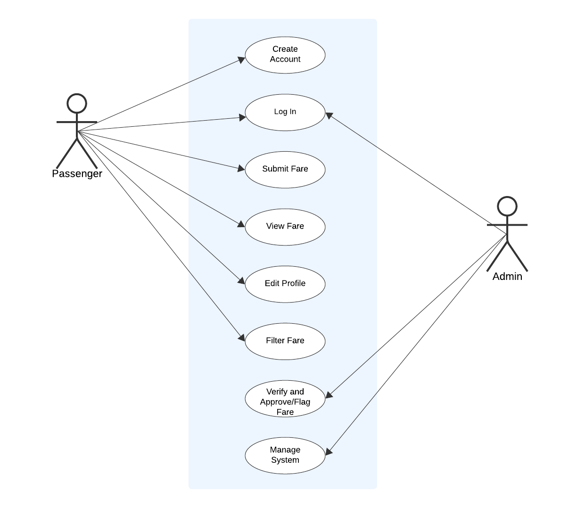
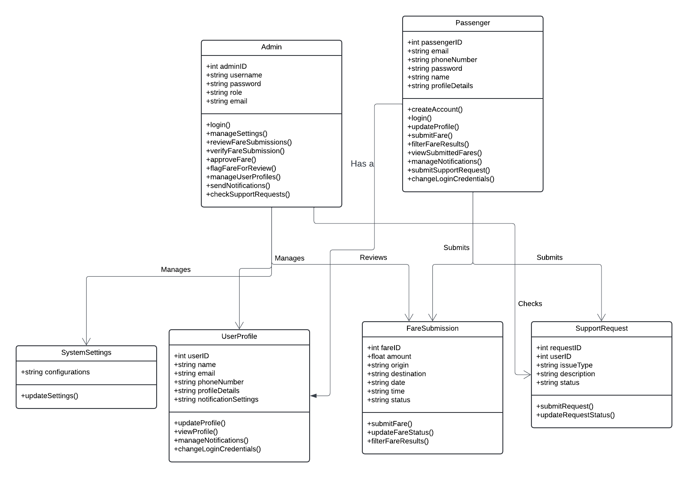
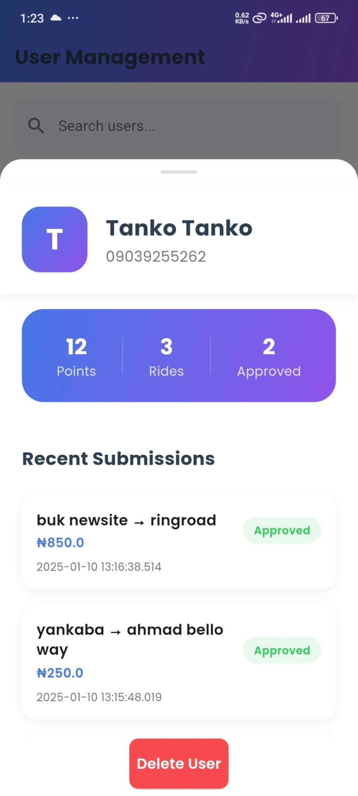
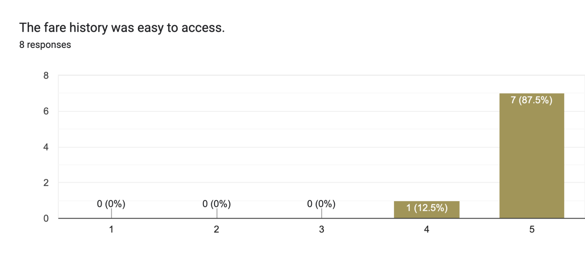
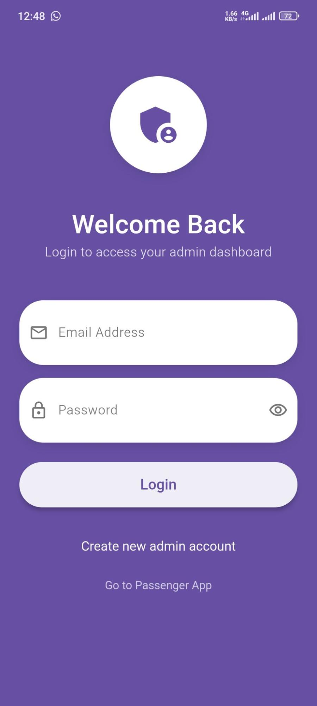

# Keke FareShare

Keke FareShare is a Flutter-based mobile application that brings transparency and fairness to Nigeria’s Keke Napep (auto-rickshaw) fare system. By combining intuitive user interfaces with intelligent data validation, Keke FareShare empowers passengers and drivers to share, compare, and validate fare information in real time.

## Key Features

### Real-Time Fare Estimates
View recommended fare ranges based on historical trip data and dynamic pricing models.

### Secure Fare Submission
Submit your actual fare after each trip. Submissions are validated by an admin team to ensure accuracy.

### Community Fare Dashboard
Browse recent submissions from other users to see how your experience compares.

## Screenshots

Below are screenshots from the Keke FareShare mobile application:

## User & Admin Roles

**Passenger:** Register, submit fares, view estimates, and explore community data.

**Admin:** Review and approve fare submissions, manage outliers, and keep the data reliable.

## System Overview

### User Registration & Authentication
Secure sign-up and login using email or social OAuth.

### Fare Estimation Engine
Leverages AI-driven anomaly detection to generate estimated fare ranges from aggregated trip data.

### Fare Submission & Validation
Passengers submit actual fares; admins review flagged entries using a rule-based and machine-learning hybrid validator.

### Community Insights
Displays heatmaps and charts of recent fares, powered by Firebase and on-device analytics.

## License

This project is licensed under the MIT License.

By harnessing AI and community-driven data, Keke FareShare brings clarity and fairness to urban mobility.
